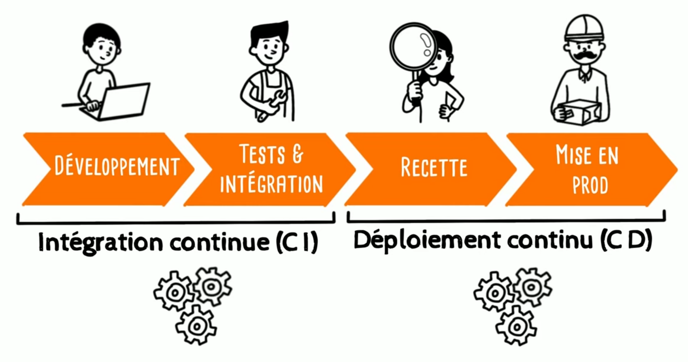
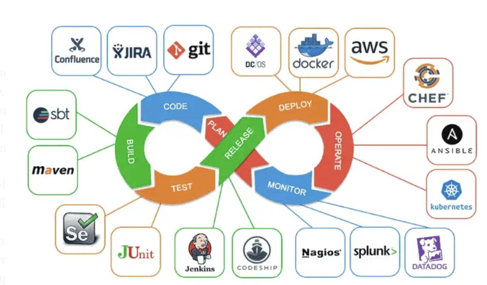
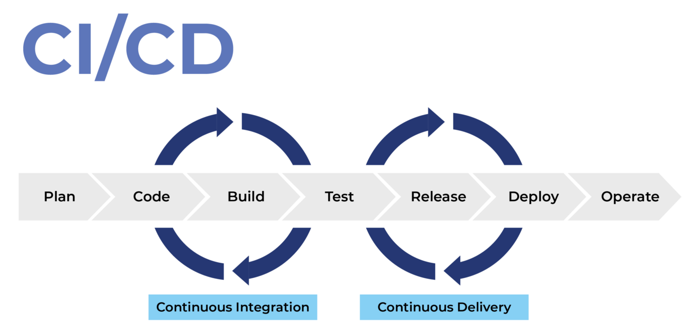

# Automatisation

## Notion de base CI/CD

- CI/CD :
    - **CI pour Continuous Intégration** (ou intégration continue en Français):<br>
    La CI couvre toute la phase de développement et de test
    - **CD pour Continuous Deployment** (ou déploiement continue en Français)<br>
    Le CD gère la mise en ligne, la distribution du logiciel et la gestion des incidents

### Métaphore pour simplifier le concept

Imaginez la CI/CD comme une chaîne de production :
- La CI est l'atelier où l'on construit et vérifie le produit
- Le CD est le camion qui livre le produit aux clients



Vous avez déjà vu passer ce genre de schéma :


### Tableau descriptif CI/CD



On y voit un peu mieux les services qui peuvent être rattaché mais c'est encore tout à faire clair.



| Terme | Type | Description | Rôle dans le processus |
|-------|------|-------------|------------------------|
| <b>Plan</b> | CI | <b>Phase initiale de planification du développement logiciel</b> | Définition des exigences, conception des fonctionnalités, création de la feuille de route du projet et planification des sprints |
| <b>Code</b> | CI | <b>Étape d'écriture du code source</b> | Les développeurs créent et écrivent le code pour les nouvelles fonctionnalités ou corrections dans un système de contrôle de version comme Git |
| <b>Build</b> | CI | <b>Compilation et transformation du code source en un artefact exécutable</b> | Transformation du code en un package ou binaire utilisable, résolution des dépendances, compilation du code source |
| <b>Test</b> | CI | <b>Validation de la qualité et du bon fonctionnement du code</b> | Exécution de tests unitaires, tests d'intégration, tests de performance, vérification de la couverture de code |
| <b>Release</b> | CD | <b>Préparation de la version pour la distribution</b> | Création d'un package final, gestion des versions, préparation des notes de release, configuration des métadonnées |
| <b>Deploy</b> | CD | <b>Déploiement de l'application dans l'environnement cible</b> | Mise en production de l'application, installation sur les serveurs, configuration des environnements |
| <b>Operate</b> | CD | <b>Maintenance et gestion de l'application en production</b> | Surveillance des performances, gestion des incidents, mises à jour continues, optimisation |

## Husky + ESLint

### Husky

Husky est un util qui permet de **gérer facilement des hooks Git** (scripts exécutés automatiquement à certaines étapes du cycle Git, comme `pre-commit`, `pre-push`, etc.) directement depuis votre projet.

En clair, il sert à **exécuter automatiquement des actions avant ou après certaines commandes Git** pour renforcer la qualité du code et éviter d’envoyer du mauvais code sur le dépôt.

[Documentation Husky](https://typicode.github.io/husky/get-started.html)

### ESLint

Il faut :
- installer l'extension VSCode
  - `ESLint` par `Microsoft`
- installer Eslint dans le projet 
  - `npm install --save-dev eslint @eslint/js typescript typescript-eslint --prefix api`
- créer un fichier de configuration (dans le dossier api, parce que c'est là qu'on a installer eslint)
  - `eslint.config.js` (a priori il y prend un fichier de config par défaut si non présent)

À mettre dans le fichier de configuration
```ts
// @ts-check

import eslint from '@eslint/js';
import tseslint from 'typescript-eslint';

export default tseslint.config(
  eslint.configs.recommended,
  tseslint.configs.recommended,
  {
    rules: {
      'semi': ['error', 'always'], // ; obligatoire en fin d'instruction
      'indent': ['error', 2], // L'intentation du code doit être de 2
      '@typescript-eslint/no-explicit-any': 'off',  // on autorise any partout pour se faciliter la vie en tant que débutant
    },
  },
  {
    ignores: ["dist"]
  }, 
);
```

Pour plus d'info sur le fichier de configuration d'ESLint: https://eslint.org/docs/latest/use/configure/configuration-files

## Github Actions

**GitHub Actions** est un service d'intégration et de déploiement continus (CI/CD) intégré directement à GitHub. Il permet d'automatiser des workflows comme :

* **Tester automatiquement le code** à chaque *push* ou *pull request*
* **Construire (build)** des applications
* **Déployer** sur des serveurs, cloud, ou autres services
* **Lancer des scripts de maintenance ou d'audit**

## Fonctionnement

Un **workflow GitHub Actions** est défini par un fichier YAML dans le dossier `.github/workflows` de votre dépôt.

Il est composé de :

* **Événements déclencheurs** : push, pull\_request, cron (programmation régulière), tag, release...
* **Jobs** : une suite d'étapes qui s'exécutent sur un runner (machine virtuelle mise à disposition par GitHub ou auto-hébergée).
* **Steps** : chaque étape peut exécuter un script ou une **action** (des fonctionnalités réutilisables créées par la communauté ou GitHub).

Exemple de fichier yml :

```yaml
name: Run Tests # On nomme notre tâche

on: # Permet de définir des événements a declencher selon certains "listener"
    push: 

jobs: # Défini une suite d'étape qui vont s'éxecuter sur notre runner
  test:
    runs-on: ubuntu-latest  # Sur quel système on va vouloir faire tourner notre application
    steps:  # Défini les différentes étapes
      - uses: actions/checkout@v3 # Équivalent au COPY . .
      - name: Install dependencies
        run: npm install
      - name: Run tests
        run: npm test
```